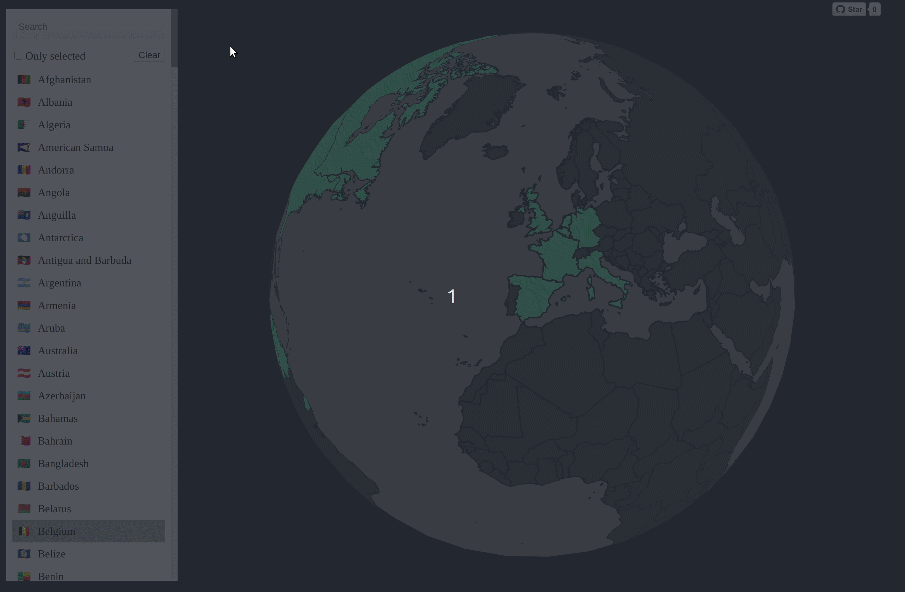

# deck.gl Globe

Trying deck.gl out :)

## Interactivity between list and globe.

- You can select items from the list and it will be highlighted in the map. Same goes the other way around.
- When an item in the list is hovered the map will set its view to that country.
- Filter list by selected and clear it

Check it live at [https://rominamartin.github.io/deckgl_globe](https://rominamartin.github.io/deckgl_globe)

